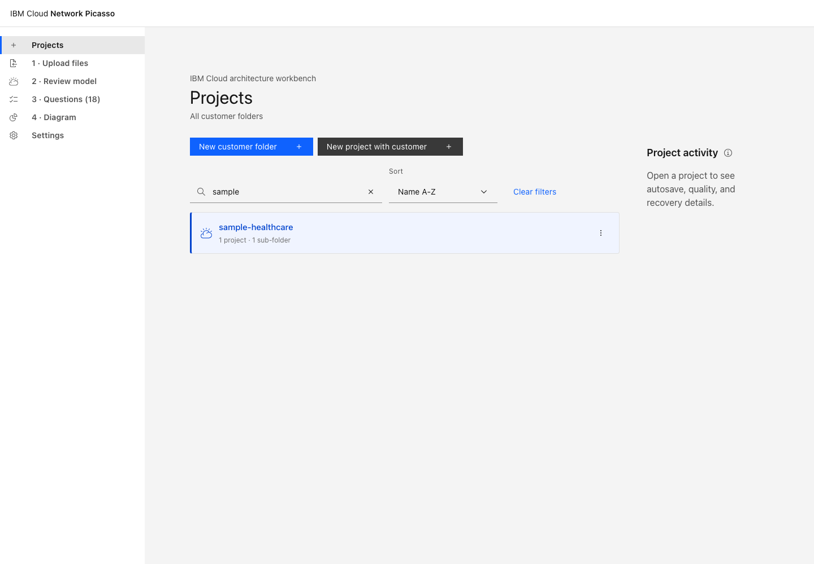
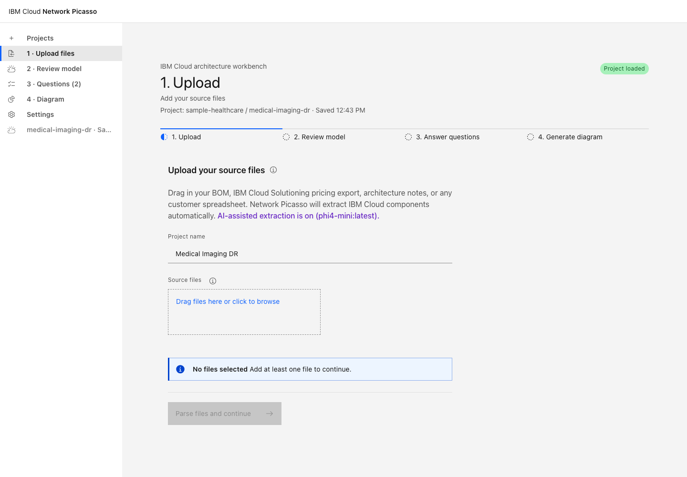
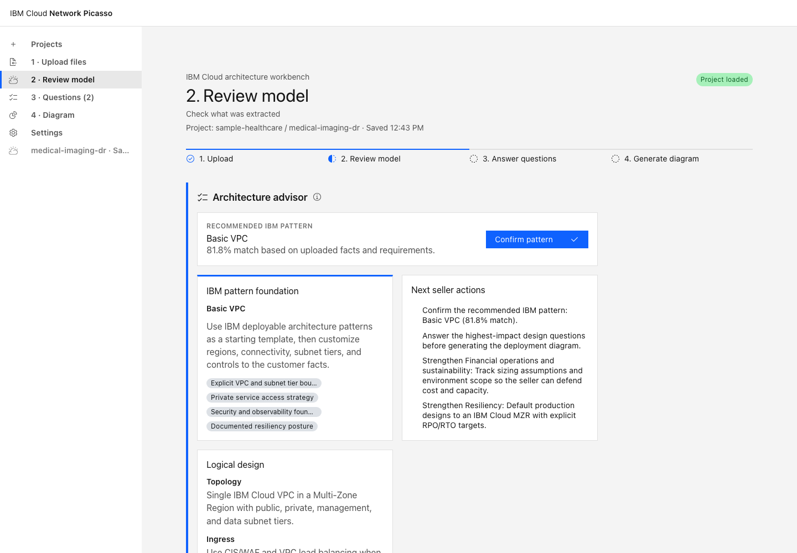
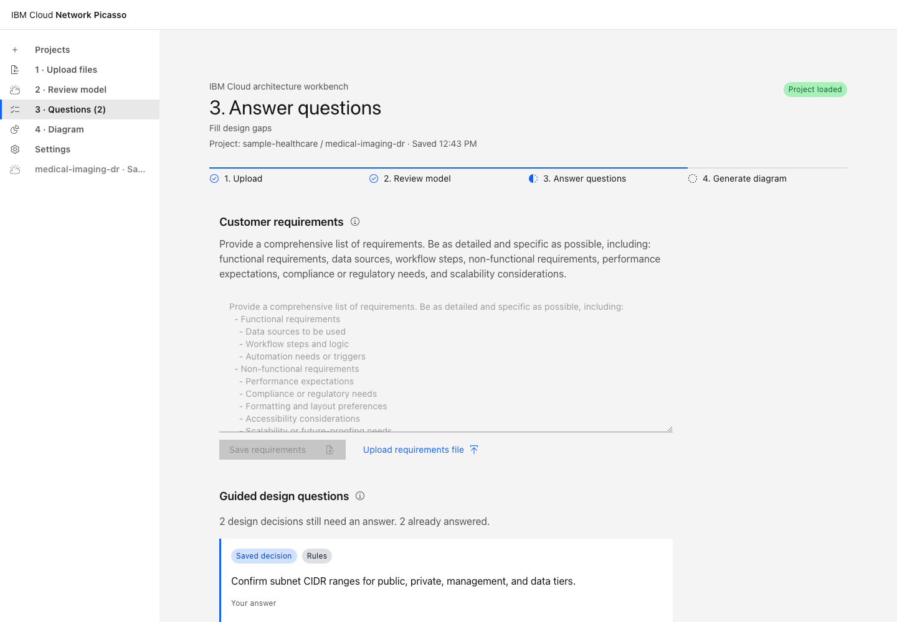
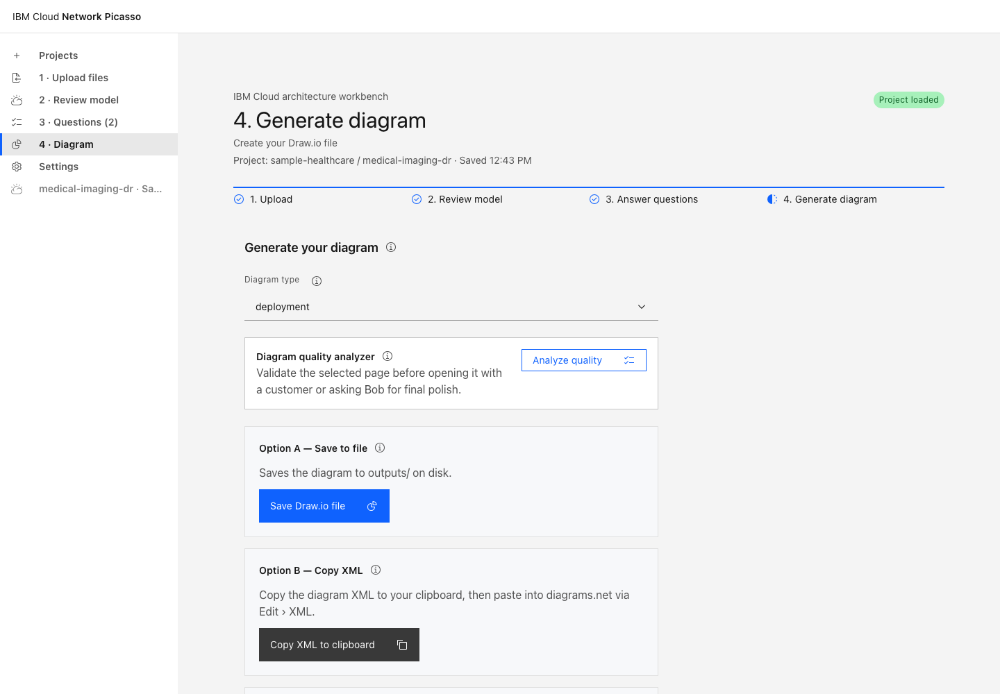
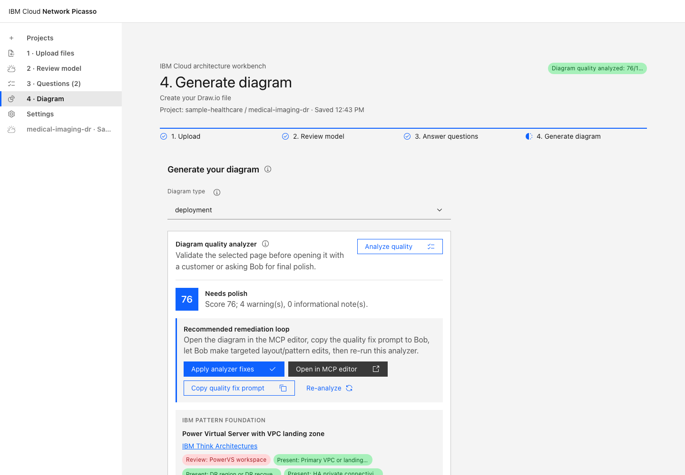
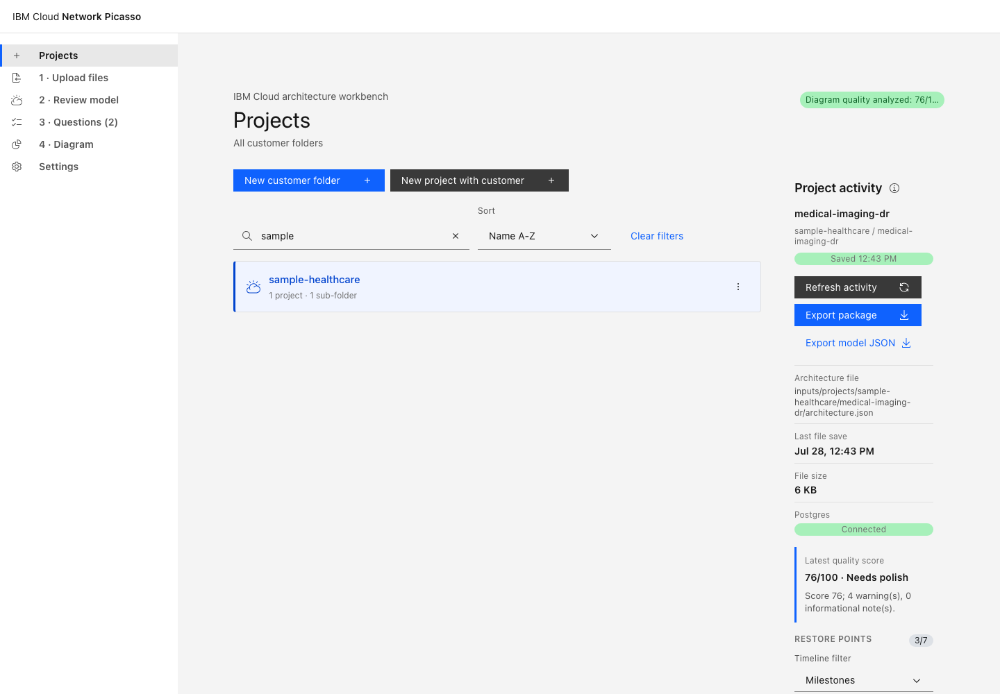
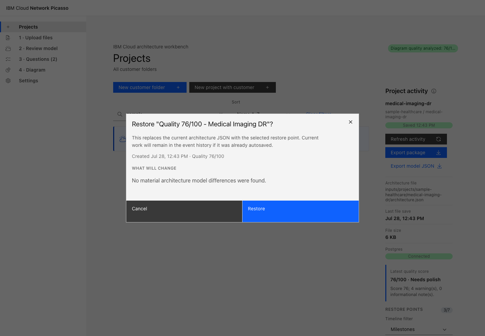

# Network Picasso User Guide

This guide is for technical sellers and solution architects who need to turn early customer
inputs into IBM-aligned architecture guidance and customer-ready Draw.io diagrams. It is written
as a screenshot-based handbook: each major step includes a screenshot slot, what the user should
see, and what to do next.

Recommended entry point: run Network Picasso with Docker Compose and open
`http://127.0.0.1:5174`.

## Screenshot Assets

Screenshots belong in:

```text
docs/images/user-guide/
```

Use the filenames referenced in this guide. If a screenshot has not been captured yet, the
caption tells you exactly what to capture.

See [docs/images/user-guide/README.md](images/user-guide/README.md) for the full screenshot
checklist.

## 1. Start The App

> Screenshot slot: `docs/images/user-guide/01-docker-compose-start.png`
> Capture a terminal showing `docker compose up --build` with the UI, API, and Postgres services running.

From the repository root:

```bash
docker compose up --build
```

Open:

```text
http://127.0.0.1:5174
```

Expected result:

- The Network Picasso UI loads in the browser.
- The API is reachable at `http://127.0.0.1:8788`.
- Postgres persistence is available through the Compose database service.

Useful health checks:

```bash
curl http://127.0.0.1:8788/api/health
curl http://127.0.0.1:8788/api/persistence/status
```

## 2. Use Projects First



Open **Projects** before uploading files. Projects give each customer/opportunity its own
workspace, autosave history, restore points, uploads, and exports.

Create a customer folder:

1. Click **New customer folder**.
2. Enter the customer name.
3. Click **Create folder**.

Create a project subfolder:

1. Open the customer folder.
2. Click **New project in this folder**.
3. Enter the project or opportunity name.
4. Click **Create project**.

Use the Projects search and filters to find work quickly:

- Search customer folders by name.
- Search projects by project name, customer name, path, or architecture status.
- Filter projects by **Has architecture** or **Needs architecture**.
- Sort folders by name or most projects.
- Sort projects by name, ready first, or needs architecture first.

## 3. Upload Customer Inputs



Good source files include:

| Input | Use it for |
|---|---|
| IBM Cloud Solutioning/pricing workbook | Services, regions, profiles, quantities, and pricing context |
| BOM spreadsheet or CSV | Customer-provided component inventory |
| Discovery notes | Business context, constraints, compliance, and topology hints |
| Existing architecture notes | Current-state network and application architecture |
| Network Picasso JSON | Importing or restoring a known architecture model |

After selecting files, click the upload/intake action. Network Picasso extracts IBM Cloud
services and creates or updates the active project architecture model.

## 4. Review The Architecture Model



Use this step to confirm that the intake process understood the customer evidence. Check:

- Regions and disaster recovery locations.
- VPCs, subnets, and network boundaries.
- Direct Link, VPN, Transit Gateway, and other connectivity.
- Compute platforms such as VSI, PowerVS, Red Hat OpenShift, or Kubernetes.
- Data services, object storage, file storage, replication, and archive.
- Security and compliance services.
- Observability and logging.

If AI-assisted extraction is enabled, review low-confidence components before accepting them into
the architecture.

## 5. Answer Design Questions



Questions are meant to help sellers who are not deep network designers. They call out important
missing decisions before a diagram is generated:

- Availability and multi-zone posture.
- Disaster recovery region, RPO, and RTO.
- Direct Link, VPN, Transit Gateway, routing, and ingress/egress.
- Private endpoints and service access.
- DNS, segmentation, and subnet tiering.
- Encryption, keys, secrets, audit logging, compliance, and monitoring.
- Backup, replication, and data retention.

Answer what is known. Leave unknown items visible as open assumptions for the architecture
conversation. Answers autosave into the active project.

## 6. Review The Architecture Advisor


Use the advisor before generating diagrams. It explains:

- Recommended IBM architecture pattern foundation.
- Alternative patterns and why they may or may not fit.
- Well-Architected-style strengths and gaps.
- Open decisions that still matter.
- Logical design guidance for the proposed network architecture.
- Seller next actions for customer follow-up.

The advisor should tell a clear story: why this architecture pattern fits the customer, which
assumptions were made, and what must be validated before implementation.

## 7. Generate Draw.io Diagrams



Network Picasso can generate five pages:

| Page | Audience | Purpose |
|---|---|---|
| Executive Overview | Executives and sellers | Simple story, business flow, primary/DR posture |
| Context | Sellers and architects | Actors, cloud boundary, major platform services |
| Logical Architecture | Architects | Relationships, dependencies, shared services, data flows |
| Deployment | Architects and implementation teams | Regions, VPCs, zones, subnets, services, connectivity |
| Assumptions & Decisions | Sellers and architects | IBM pattern traceability, inferred choices, validation items, and quality status |

Recommended flow:

1. Click **Generate all diagram types**.
2. Confirm diagrams.net opens one file with five pages.
3. Review the Deployment page for topology and labels.
4. Save the `.drawio` file if you made manual edits.

## 8. Analyze Diagram Quality



Run the analyzer after generating diagrams. It checks:

- Label fit and overlap risk.
- Crowded containers or subnets.
- Connector readability.
- IBM pattern alignment.
- Customer-readiness issues.

Use the remediation loop:

1. Run **Diagram quality analyzer**.
2. Click **Apply analyzer fixes** for model-safe IBM pattern-foundation recommendations.
3. Regenerate the diagram.
4. Open the diagram in MCP editor when visual polish is needed.
5. Use **Copy prompt** or **Copy + open MCP** for the guided remediation preset that matches the issue.
6. Paste the copied prompt into Bob to begin the edit.
7. Watch the **Current remediation session** status for the copied preset, target page, MCP handoff state, and re-analysis reminder.
8. Re-run the analyzer.

The analyzer is most useful when paired with action. It identifies model fixes that Network
Picasso can apply and presentation fixes that Bob/MCP should handle. The guided presets include
current analyzer findings and five-page guardrails so sellers do not need to write Draw.io
editing prompts from scratch. **Copy + open MCP** opens the Draw.io MCP editor and copies the
prompt, but it does not submit the prompt into Bob automatically. After a preset is copied, the
session status remains visible until the next analyzer run confirms the loop has been checked.

## 9. Use Project Activity And Restore Points



Project Activity confirms the project is being saved and gives you recovery options.

Use it to:

- Confirm autosave is working.
- See where `architecture.json` is stored.
- Confirm Postgres persistence is connected.
- Check the latest diagram quality score.
- Review recent events.
- Restore an earlier architecture state.

Timeline filters:

- Milestones.
- All restore points.
- Autosaves.
- Intake and imports.
- Design decisions.
- Quality checks.
- Restores and syncs.



Before restoring, review the comparison. Restore only when the target state is clearly the one
you want to recover.

## 10. Export The Customer Package


Use **Export package** after the architecture has been reviewed, diagrams generated, quality
checked, and optionally polished with Bob/MCP.

The ZIP includes:

- `architecture.json`.
- Four-page `.drawio` architecture file.
- Architecture summary.
- IBM pattern alignment report.
- Diagram quality report.
- Assumptions, open questions, and answered questions.
- Project activity and restore-point metadata.

## 11. Configure Bob And Draw.io MCP

> Screenshot slot: `docs/images/user-guide/12-bob-mcp-settings.png`
> Capture IBM Bob settings showing MCP server `drawio` connected.

Bob/MCP is optional. Use it when generated diagrams need conversational editing or final visual
polish.

The repository includes Bob configuration:

```text
.bob/mcp.json
.bob/skills/ibm-drawio-editing.md
```

Expected Bob setup:

1. Open the `Network Picasso` folder in Bob.
2. Open Bob settings.
3. Find MCP.
4. Confirm `drawio` appears and shows connected.
5. Open `http://127.0.0.1:4000` in a browser.
6. In Network Picasso, click **Check** in the MCP card.
7. Click **Open in MCP editor** or **Open all pages in MCP editor**.

> Screenshot slot: `docs/images/user-guide/13-drawio-mcp-editor.png`
> Capture the Draw.io MCP editor at `http://127.0.0.1:4000` with the generated diagram loaded.

Useful guided remediation presets:

- **Fix labels and spacing**
- **Clean connector routing**
- **Polish Deployment page**
- **Review all five pages**
- **Improve IBM pattern alignment**
- **Prepare customer-ready version**

Choose the **Remediation target** before copying a Bob prompt: current diagram type, a specific
Draw.io page, or all five pages. Use **Verify MCP tabs** to confirm the live editor has the
expected five tabs, and **Rebuild MCP pages** if stale or duplicate tabs appear. Use **Copy prompt**
when Bob is already in front of you. Use **Copy + open MCP** when you also need to bring the
Draw.io MCP editor tab forward. Then paste the copied prompt into Bob.

## 12. Finish, Export, And Remember Style

When the diagram is ready for a customer conversation, use **Finished: export package** in the
diagram workspace. Network Picasso downloads a ZIP with the current architecture model, the
five-page `.drawio` file, IBM pattern alignment, quality findings, assumptions/open questions,
project activity, and style memory files.

If the Draw.io MCP editor is running, the ZIP uses the live edited Draw.io document. If MCP is
not running, the ZIP uses the generated diagram from the saved architecture model.

After starting the export, the app asks whether to remember this Draw.io style. Use
**Remember globally for future projects** when the label size, spacing, connector routing, and
page order match how you want Network Picasso diagrams to look by default. Use
**Remember for this project** when the preference is customer-specific. Future Bob/MCP prompts
inherit the global memory unless a project-level override exists.

## 13. Troubleshooting

| Issue | Likely cause | Action |
|---|---|---|
| UI does not load | Compose stack is not running or port `5174` is busy | Run `docker ps`; restart with `docker compose up --build` |
| API health fails | API container is stopped or unhealthy | Check `network-picasso-api` logs and rebuild |
| Persistence disconnected | Postgres container is unavailable | Confirm `network-picasso-db` is healthy |
| No restore points | No autosave/intake/event yet, or Postgres is disconnected | Open a project and trigger intake, answer, quality check, or manual sync |
| Only one Draw.io page opens | Single-page action was used or browser has stale UI | Use **Generate all diagram types** and refresh the app |
| Bob shows `drawio` disconnected | MCP server has not started or Bob needs refresh | Refresh Bob MCP, reopen the workspace, and open `http://127.0.0.1:4000` |
| MCP editor is open but app says unavailable | Container cannot reach host MCP endpoint | Confirm `NETWORK_PICASSO_MCP_BASE_URL=http://host.docker.internal:4000` |
| Diagram labels overlap | Layout needs presentation polish | Run analyzer, copy Bob remediation prompt, edit via MCP, then re-analyze |
| AI questions are too generic | Source files lack context or Ollama mode is off | Add requirements notes and re-run intake |

## Seller Demo Script

Use this short script for a live walkthrough:

1. Start with Docker Compose and open `http://127.0.0.1:5174`.
2. Create a customer folder and project.
3. Upload sample BOM/pricing/discovery notes.
4. Review extracted architecture components.
5. Answer two or three design-gap questions.
6. Show the advisor pattern recommendation and logical design.
7. Generate all five Draw.io pages.
8. Run quality analyzer and explain the remediation loop.
9. Open the diagram in MCP editor and copy a Bob prompt.
10. Show Project Activity, restore timeline, and export package.

The key message: Network Picasso does not replace architecture judgment. It gives a technical
seller a structured, IBM-aligned starting point and a recoverable workflow for improving the
design with an architect or Bob-assisted Draw.io editing.
